# api
my cloud api or quickly serverless api

Deploy them on vercel or heroku. And base on it to call anywhere.

## pioneer
silverswords/zeit-yuque
silverswords/zeit-github
silverswords/clouds

## Why
many people wondering why need deploy on cloud. Because these api could directly called by SDK so eazily. This question is the answer.